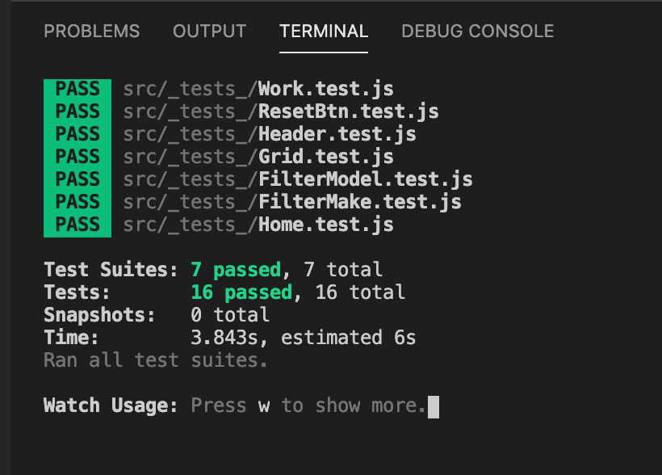

# Artworks Display Board

## Content

- [Introduction](#introduction)
- [Details](#details)
  - [Highlights](#highlights)
  - [Unit Test](#running-unit-test)
- [Prerequisites](#prerequisites)
- [Quick Start](#quick-start)
- [Running locally](#running-locally)
  ​

## Introduction

This project is to build an image works display board and provide the function of filtering to help the user find the work easily.

The tasks are:

1. Consume a GraphQL API and retrieve the works data.
2. Display the small thumb image of every work, and the information of camera make and model.
3. The user can filter the works by camera make and model.
4. Diplay "Unknown Model" and "Unknown Make" as the model or make for works which are excluded in API.

​

## Details:

### Highlights

- Using [React](https://reactjs.org/) to create reusable components.
- Responsive UI design, mobile friendly.
- Spinner solution used when data loading.
- Alert solution used when improper filtering.
- Friendly error information will be appearing when there is the error occured.
- Reset button provided.

## Running unit test

1. run npm start first and keep the program running

2. npm run test to lauch the test

3. Using Jest and Enzyme to have unit testing
   

## Prerequisites

1. Node.js - Download and Install Node.js. You can also follow this gist for a quick and easy way to install Node.js and npm

2. NPM - Install NPM for all dependencies both in server and client.

## Quick Start

Install dependencies :
npm install

## Running locally

Run the client :
npm start

Run the unit test:
npm run test
